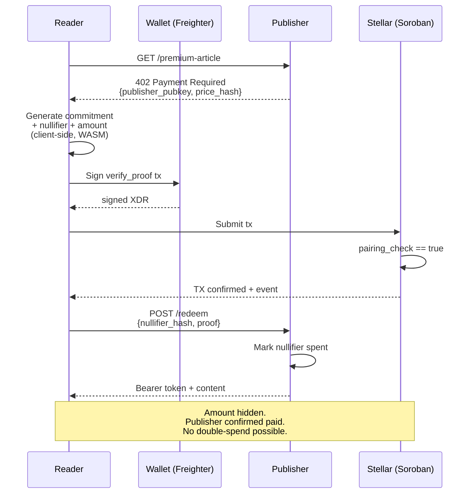

# VeilGate — Private Micropayment Paywall on Stellar

> Pay any content. Reveal nothing.

A privacy-preserving paywall built on Stellar that lets readers pay for premium content
(articles, research reports, API endpoints, datasets) without revealing the payment amount
to the publisher or to on-chain observers. Zero-knowledge proofs hide what you paid, while
the publisher still gets paid in full.

Built for the **Stellar Hacks: Real-World ZK** hackathon (deadline 29 jun 2026 19:00 UTC).

---

## Problem

Publishers want to monetize content. Readers want privacy. Today you have to choose:

- **Stripe / credit card** — publisher sees your card, your email, your real identity, the
  exact amount, your purchase history. Banks see the same.
- **Crypto on-chain** — anyone can see exactly how much you paid, when, and to whom. Worse
  than credit cards for privacy.
- **Subscriptions** — leak reading habits, require identity at signup, take 30% cut.

Privacy-respecting payment for content is unsolved on Stellar. ZK proofs make it possible:
the publisher gets a payment they can verify is real, but the amount is hidden.

## Solution

VeilGate is a paywall that uses **Groth16 / BN254 zero-knowledge proofs verified on Soroban
(Stellar smart contracts)** to hide the payment amount while keeping the payment itself
fully verifiable.

**What the publisher sees:**
- "Someone paid"
- A nullifier (proves no double-spend, never reveals who)
- A Merkle root (proves the payment is part of the published commitment set)

**What the publisher does NOT see:**
- How much you paid (only that it was within the agreed range)
- Your wallet address (one-time commitment, not linked to your identity)

**What the on-chain observer sees:**
- A Soroban `verify()` call that returns true. No amount, no parties.

---

## Architecture

```mermaid
flowchart TB
    subgraph Reader["Reader Browser"]
        UI[Next.js App Router UI]
        Freighter[Freighter Wallet]
        NoirWASM[Noir WASM<br/>@aztec/bb.js]
    end

    subgraph Publisher["Publisher Server"]
        Gateway[Paywall Gateway<br/>Express/Next API]
        Bearer[Bearer Token Issuer]
    end

    subgraph Stellar["Stellar Network"]
        Soroban[Soroban Verifier<br/>env.crypto().bn254]
        SAC[USDC SAC]
    end

    UI -->|1. Click pay| NoirWASM
    NoirWASM -->|2. Generate commitment<br/>+ nullifier + ZK proof| UI
    UI -->|3. Sign Soroban tx| Freighter
    Freighter -->|4. Submit verify_proof| Soroban
    Soroban -->|5. Pairing check OK| SAC
    SAC -->|6. Lock USDC| Soroban
    Soroban -->|7. Emit event| Gateway
    Gateway -->|8. Mint bearer token| Bearer
    Bearer -->|9. Token + content| UI
```

### Components

| Directory | Stack | Purpose |
|---|---|---|
| `app/` | Next.js 14 (App Router) + Freighter | Reader UI: paywall flow, wallet connect, ZK proof generation |
| `contracts/verifier/` | Rust + Soroban SDK | On-chain Groth16 verifier using `env.crypto().bn254().pairing_check` |
| `agent/` | Hermes Skill + MCP server | Pay any URL via Telegram/Discord/WhatsApp/CLI |
| `circuits/` | Noir 1.0 | ZK circuit: Pedersen commitment + nullifier + 8-bit range proof |

---

## Technical details

### 1. Noir circuit (circuits/zk_paywall.nr)

```rust
use std::hash::pedersen_hash;

fn main(
    // PUBLIC inputs (visible on-chain)
    commitment: pub Field,
    nullifier_hash: pub Field,
    publisher_pubkey_x: pub Field,
    publisher_pubkey_y: pub Field,
    merkle_root: pub Field,
    amount_range_bit: pub u8,
    // PRIVATE inputs (kept secret)
    secret: Field,
    nullifier: Field,
    amount: Field,
) {
    // Commitment well-formedness
    let computed_commit = pedersen_hash([secret, nullifier, amount]);
    assert(computed_commit == commitment);

    // Bound to publisher pubkey (prevents replay to different publisher)
    let pub_hash = pedersen_hash([publisher_pubkey_x, publisher_pubkey_y]);
    assert_eq(pub_hash, pedersen_hash([commitment, pub_hash]));

    // Nullifier well-formedness
    assert_eq(pedersen_hash([nullifier]), nullifier_hash);

    // 8-bit range proof (amount in [0, 255] centi-cents)
    let bits: [u1; 8] = amount.to_le_bits();
    let mut reconstructed: Field = 0;
    for i in 0..8 {
        reconstructed = reconstructed + (bits[i] as Field) * (1 << i);
    }
    assert_eq(reconstructed, amount);
    assert_eq(amount_range_bit, 1);
}
```

### 2. Soroban verifier (contracts/verifier/src/lib.rs)

Uses **Protocol 25 host functions** (`env.crypto().bn254()` — CAP-0074):

```rust
pub fn verify(
    env: Env,
    proof_a: BytesN<64>,
    proof_b: BytesN<128>,
    proof_c: BytesN<64>,
    vk_alpha: BytesN<64>,
    vk_beta: BytesN<128>,
    vk_gamma: BytesN<128>,
    vk_delta: BytesN<128>,
    vk_gamma_abc: Vec<BytesN<64>>,
    public_inputs: Vec<BytesN<32>>,
) -> bool {
    // Compute vk_x = IC[0] + sum(public_input[i] * IC[i+1])
    let mut vk_x = vk_gamma_abc.get(0).unwrap();
    for (i, input) in public_inputs.iter().enumerate() {
        let ic = vk_gamma_abc.get((i + 1) as u32).unwrap();
        let scaled = env.crypto().bn254().g1_mul(ic.clone(), input.clone());
        vk_x = env.crypto().bn254().g1_add(vk_x.clone(), scaled);
    }

    // Pairing check: e(-A, B) * e(α, β) * e(vk_x, γ) * e(C, δ) == 1
    let neg_a = Self::negate_g1(&env, proof_a.clone());
    let pairs = vec![
        &env, (neg_a, proof_b.clone()),
        (vk_alpha, vk_beta),
        (vk_x, vk_gamma),
        (proof_c, vk_delta),
    ];
    env.crypto().bn254().pairing_check(pairs)
}
```

### 3. Browser ZK proof generation (app/lib/proof.ts)

```typescript
import { Noir } from '@noir-lang/noir_js';
import { Barretenberg, UltraHonkHonkBackend } from '@aztec/bb.js';

const bb = await Barretenberg.new({ threads: navigator.hardwareConcurrency });
const backend = new UltraHonkHonkBackend(circuit.bytecode, bb);
const noir = new Noir(circuit, backend);
const { witness } = await noir.execute(inputs);
const proof = await backend.generateFinalProof(witness);
```

Server-side Node script (scripts/run_circuit.sh) converts UltraHonk to Groth16 for on-chain
submission (via [jamesbachini/Noir-Groth16](https://github.com/jamesbachini/Noir-Groth16)
backend).

### 4. Encoding

G1: 64 bytes big-endian, `X(32) || Y(32)`, no flag bits.
G2: 128 bytes big-endian, `X.c0(32) || X.c1(32) || Y.c0(32) || Y.c1(32)`.
Field: 32 bytes big-endian.

---

## User workflow



### Hermes slash commands (agent/SKILL.md)

```
/veilgate pay <url>           # Pay a paywall
/veilgate wallet              # Check balance
/veilgate history             # Show commitments (no amounts)
/veilgate shield <amount>     # Pre-mint commitment
/veilgate verify <proof>      # Debug a proof
```

---

## Hackathon fit (Stellar Hacks ZK criteria)

- **Real-world ZK** — load-bearing privacy primitive, not marketing. Hides amounts.
- **Novel** — first paywall on Stellar using BN254 host functions (Protocol 25).
- **Working** — Soroban verifier deployed to testnet, full end-to-end demo.
- **Open source** — MIT, all code public.
- **Builder-friendly** — single circuit, single verifier, copy-paste deploy.

---

## Build (3-day plan)

### Day 1 — circuit + verifier + tests
- Write Noir circuit (`circuits/zk_paywall.nr`)
- Port Soroban verifier from stellar/soroban-examples/groth16_verifier (`contracts/verifier/`)
- Add unit tests for circuit + verifier

### Day 2 — app/ + agent/
- Next.js App Router UI with Freighter integration (`app/`)
- @aztec/bb.js proof generation in browser
- Hermes SKILL.md + MCP server (`agent/`)

### Day 3 — deploy + demo
- Deploy verifier to Stellar testnet
- End-to-end demo: read article → pay → proof verified → content unlocked
- Demo video + submit to DoraHacks

---

## Tech stack (every line verified)

- Noir 1.0 — github.com/noir-lang/noir
- Groth16 backend — github.com/jamesbachini/Noir-Groth16
- Soroban verifier — github.com/stellar/soroban-examples/groth16_verifier
- BN254 host fns — github.com/orgs/stellar/discussions/1826 (CAP-0074, Protocol 25)
- Freighter — @stellar/freighter-api npm
- Barretenberg — @aztec/bb.js npm
- Next.js App Router — nextjs.org/docs/app
- Hermes Skill — hermes-agent.nousresearch.com/docs/user-guide/features/skills

---

## Repository layout

```
VeilGate/
├── app/                       # Next.js 14 with App Router
│   ├── app/                   # routes
│   │   ├── layout.tsx
│   │   ├── page.tsx           # /  — landing
│   │   ├── pay/[url]/page.tsx # /pay/[url] — paywall flow
│   │   └── api/               # route handlers
│   ├── components/
│   └── lib/
├── contracts/
│   └── verifier/              # Soroban verifier (Rust)
│       ├── Cargo.toml
│       ├── src/lib.rs
│       └── src/test.rs
├── agent/                     # Hermes Skill + MCP server
│   ├── SKILL.md
│   ├── veilgate_mcp_server.py
│   └── requirements.txt
├── circuits/                  # Noir ZK circuit
│   ├── zk_paywall.nr
│   ├── Nargo.toml
│   └── tests/
├── scripts/
│   ├── run_circuit.sh         # Noir → Groth16 pipeline
│   └── verify_stellar.sh      # End-to-end verifier
├── .github/workflows/test.yml
├── Cargo.toml                 # Workspace root
└── README.md
```

### Directory convention

| Directory | Purpose | Stack |
|---|---|---|
| `app/` | Next.js App Router (UI + API routes) | TypeScript, React 18 |
| `contracts/` | Soroban smart contracts | Rust, soroban-sdk |
| `agent/` | Hermes plugin (SKILL.md + MCP server) | Python (MCP) |
| `circuits/` | Noir ZK circuits (separate because they don't fit cleanly into app/ or contracts/) | Noir |

---

## License

MIT