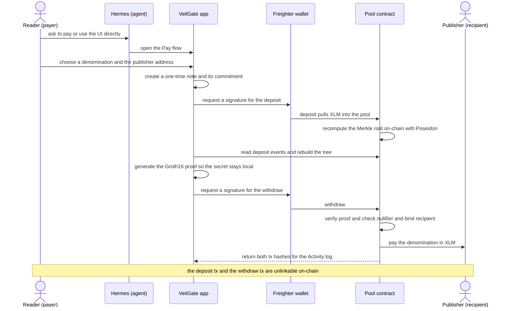
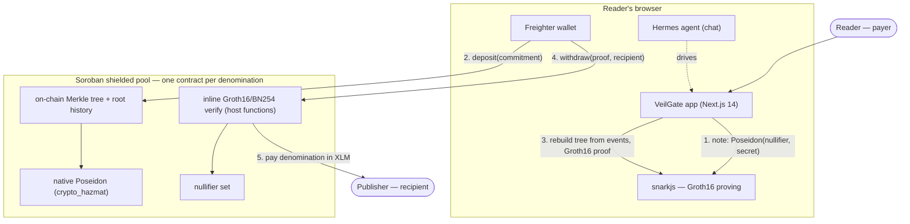

# VeilGate — Private Micropayments on Stellar

> Pay a publisher. Reveal nothing about who you are.

VeilGate lets a reader pay a publisher for content through a **zero-knowledge shielded pool**
on Stellar. Real value moves on testnet, but the link between *your deposit* and *the payment
the publisher receives* is broken — an on-chain observer cannot tell which deposit paid which
publisher, and the publisher never learns your wallet identity.

Built for the **Stellar Hacks: Real-World ZK** hackathon. Live: **https://veilgate.vercel.app**

---

## The problem

Paying for something on a public blockchain is the opposite of private: anyone can see who paid
whom, how much, and when. For micropayments — tipping a writer, unlocking an article, paying a
contributor — that permanently links your wallet (your identity) to everything you buy and read.
Card rails are no better: the processor and the publisher see your identity and full history.

So today you must choose between *paying privately* and *paying verifiably on-chain*. VeilGate
removes that choice.

## The solution

A **shielded pool**. You deposit a fixed amount; later, an unrelated withdrawal pays the publisher
out of the pool. A zero-knowledge proof convinces the contract that the withdrawal corresponds to
*some* earlier deposit — without revealing *which* one. The payment is real, on-chain, and
verifiable; the link between you and the publisher is not.

What makes it **trustless**: the pool contract recomputes its Merkle root **on-chain** with the
native Poseidon hash (no operator publishing roots), binds each proof to its recipient (no
front-running), and records nullifiers (no double-spend). All of it verified on Stellar testnet.

---

## What it actually does (and doesn't)

VeilGate is a **fixed-denomination shielded pool**, so be precise about the privacy it gives:

- **Hidden — unlinkability.** You deposit into a pool; later a withdrawal pays the publisher.
  A Groth16 proof shows the withdrawal corresponds to *some* deposit in the pool without
  revealing *which*. Deposit ↔ payment is unlinkable.
- **Hidden — your identity.** The note (secret + nullifier) is one-time and never tied to your
  wallet. The publisher only sees an address paying out of the pool contract.
- **Public — the denomination.** The amount is the pool's fixed denomination (0.1 / 1 / 10 XLM).
  Privacy comes from the anonymity set of equal-sized deposits, not from hiding the number.

No custodian, no operator, no trusted root publisher — the **contract itself** computes and
anchors the Merkle root on every deposit.

> Research / hackathon code. Not audited — do not use with real funds.

---

## How a payment works

```
pick a denomination (0.1 / 1 / 10 XLM)
        │
        ▼
1. note      reader's browser samples secret + nullifier, commitment = Poseidon(nullifier, secret)
2. deposit   Freighter signs: pull the denomination into the pool, insert the commitment.
             The CONTRACT recomputes the Merkle root on-chain with native Poseidon.
3. prove     the browser rebuilds the tree from on-chain deposit events, then generates a
             Groth16 proof (snarkjs) that the note is in the tree + a fresh nullifier hash +
             a recipient binding — the secret never leaves the device.
4. withdraw  the contract verifies the proof against a recent root, checks the nullifier is
             unspent, and transfers the denomination to the publisher.
```

The deposit and the withdraw are two separate, unlinkable on-chain transactions.

## Roles

VeilGate has only three roles — and crucially, **no operator or custodian**:

| Role | Who | What they do / see |
|---|---|---|
| **Reader (payer)** | the person paying | Connects Freighter, picks a denomination, deposits, generates the proof in their browser, and pays a publisher. Holds the note secret — it never leaves their device. |
| **Publisher (recipient)** | who gets paid | Shares a `G…` address and receives XLM out of the pool. Only ever sees an address paying *from the pool contract* — never the reader's wallet. |
| **Hermes (agent)** | optional assistant | An in-app chat agent. Drives the *same* on-chain operations (`/settle`, `/wallet`, `/history`, `/verify`) on the reader's behalf. Never touches keys or the note secret. |
| ~~Operator / admin~~ | nobody | There is none. The contract recomputes the root itself; no one publishes roots or holds funds. |

## How you interact with it



## How to use it

1. Open **https://veilgate.vercel.app** and connect **Freighter** (Stellar **testnet**). Fund the
   account from the testnet faucet if needed.
2. Go to **Pay**, paste a publisher's `G…` address, and pick a denomination (0.1 / 1 / 10 XLM).
3. Sign the two transactions Freighter prompts (deposit, then withdraw). The proof is generated
   locally in your browser — the note secret never leaves the tab.
4. Open **Activity** for the receipt: both transaction hashes (clickable to stellar.expert), the
   proof-verified badge, the nullifier, and the root the contract matched.

## Tokens

The shielded pool settles in **native XLM** on Stellar **testnet** — the deposit pulls XLM in and
the withdrawal pays the publisher XLM. That is the only token in the real flow.

> A separate x402 content endpoint (`app/api/content`, `agent/x402`) references **USDC** — it is a
> demo scaffold, not part of the judged settlement, and moves no value.

---

## Status — what is verified

| Piece | State |
|---|---|
| **Shielded-pool settlement** (Soroban) | ✅ Real 0.1 / 1 XLM payments moved on **testnet**, deposit→prove→pay |
| **Trustless on-chain Merkle root** | ✅ Contract recomputes the root with **native Poseidon** (`env.crypto_hazmat()`); no operator |
| **Withdraw circuit** (Circom + Groth16) | ✅ membership + nullifier + recipient binding; ~11k constraints |
| **On-chain Groth16/BN254 verify** | ✅ inline in the pool via native host functions — fits the testnet per-tx budget |
| **Recipient binding** | ✅ proof bound to `recipient` on-chain (`sha256(strkey)`); front-run → `ProofInvalid` (testnet) |
| **Multiple denominations** | ✅ 0.1 / 1 / 10 XLM, one pool each |
| **Tests** | ✅ `cargo test -p pool` (7) + a tree-reconstruction proof test (`npm test`) |
| **Next.js app** | ✅ Builds; full deposit→prove→pay flow with Freighter + browser proving |

### Earlier exploration (kept, honest about its limits)
A Noir circuit + Barretenberg **UltraHonk** path also exists (`circuits/`, `contracts/ULTRAHONK_ONCHAIN.md`).
UltraHonk verification is compute-heavy and **exceeds the testnet per-tx budget** (works on a
localnet with raised limits). The live product therefore settles via the **Groth16** path, which
uses the native BN254 host functions and verifies on testnet.

---

## Deployed on testnet

| What | Address |
|---|---|
| Pool — 0.1 XLM | `CDZGIFZFRFKYIMSPBLA2OSFVD5RIUVVVWRVN5LPAHYHDGH6LOEGKGD7H` |
| Pool — 1 XLM | `CBIIKKJHZKA77YWXIITCUX6HFVEWIZAJYKO2Q6ZL3SJ3ZTFUY4RESJ2Z` |
| Pool — 10 XLM | `CB27XGZ53S3WGDJE3MN3EHKPBXAMELAK7NY5ZD42ES7ZSLMF7AHTC57E` |
| Token | native XLM SAC `CDLZFC3SYJYDZT7K67VZ75HPJVIEUVNIXF47ZG2FB2RMQQVU2HHGCYSC` |

What was exercised on-chain (0.1 XLM pool):

```
deposit(commitment)            -> 0.1 XLM in; root recomputed ON-CHAIN == the prover's root
withdraw(proof, …, ATTACKER)   -> Error #3 ProofInvalid   (recipient-bound; nullifier NOT spent)
withdraw(proof, …, publisher)  -> proof verified on-chain, publisher paid 0.1 XLM
re-withdraw same nullifier     -> Error #2 NullifierSpent  (double-spend blocked)
```

---

## Architecture



---

## How it works

### Withdraw circuit (`pool/circuits/withdraw.circom`, Groth16)
Proves, in zero knowledge:
1. **Knows a note** whose `commitment = Poseidon(nullifier, secret)`.
2. **Membership**: the commitment is a leaf of a depth-20 Merkle tree with public `root`
   (Poseidon hashes).
3. **Nullifier**: publishes `nullifierHash = Poseidon(nullifier)` to prevent double-spend.
4. **Recipient binding**: a public `recipient` field the contract re-derives, so the proof only
   pays the intended account.

### Pool contract (`contracts/pool/`, Soroban / Rust)
- **`merkle.rs`** — an on-chain incremental Merkle tree with a recent-root ring buffer
  (`ROOT_HISTORY = 30`). `deposit` inserts the commitment and **recomputes the root on-chain**.
- **`poseidon.rs`** — circomlib-compatible Poseidon(2) over BN254 via the native host function
  `env.crypto_hazmat().poseidon_permutation` (feature `hazmat-crypto`), validated bit-for-bit
  against circomlib.
- **`lib.rs`** — `withdraw` runs the Groth16/BN254 pairing check inline via `g1_mul` / `g1_add` /
  `pairing_check`, derives the recipient field from the `recipient` Address (`sha256(strkey)`),
  checks the nullifier, and transfers the denomination. **No operator, no admin.**

### App (`app/`, Next.js 14)
`lib/pool.ts` runs the whole flow in the browser: sample the note, deposit via Freighter, rebuild
the tree from on-chain `deposit` events to get the membership path, generate the Groth16 proof with
snarkjs, and withdraw. `components/hermes.tsx` is a guided assistant that walks the reader through it.

---

## Tests

```bash
# Contract: native Poseidon vector, on-chain root == prover root, withdraw pays,
# front-run rejected, double-spend rejected, unknown root rejected, root history.
cd contracts && cargo test -p pool          # 7 tests

# Tree reconstruction: rebuild the tree for several leaf indices and prove each verifies.
cd pool && npm install && npm test          # pathFor(1,0) / (2,1) / (5,3) -> proofs verify

# App: API routes, the Hermes agent, lib helpers, and the transaction log.
cd app && npm install && npm test           # 22 tests (vitest)
```

---

## Run the app

The fastest path — the app already points at the deployed testnet pools, so you only need the
frontend. You'll need [Freighter](https://www.freighter.app/) on Stellar **testnet**.

```bash
cd app
npm install
cp .env.example .env.local      # defaults already point at the live testnet pools
npm run dev                     # http://localhost:3000
```

Then connect Freighter, open **Pay**, paste a publisher `G…` address, pick a denomination, and sign
the two prompts. Or just use the hosted build: **https://veilgate.vercel.app**.

### Rebuild the contracts + circuit from scratch (optional)

```bash
# 1. circuit artifacts + a demo note/proof
cd pool && npm install && npm run build:circuit
PUBLISHER=G... node scripts/pool_demo.mjs        # writes /tmp/pool_demo.env

# 2. build + deploy a pool (one per denomination)
cd ../contracts && stellar contract build
stellar contract deploy --wasm target/wasm32v1-none/release/pool.wasm --source <key> --network testnet -- \
  --token CDLZFC3SYJYDZT7K67VZ75HPJVIEUVNIXF47ZG2FB2RMQQVU2HHGCYSC --denom 1000000 \
  --vk_alpha <hex> --vk_beta <hex> --vk_gamma <hex> --vk_delta <hex> --vk_ic '[<hex>,…]'

# 3. point the app at your new pool ids (app/.env.local) and run it
```

---

## Repository layout

```
VeilGate/
├── pool/                       # settlement: Circom withdraw circuit + Groth16 proving
│   ├── circuits/withdraw.circom
│   └── scripts/                # pool_demo.mjs (note+proof), pathfor_test.mjs (npm test)
├── contracts/
│   ├── pool/                   # the shielded pool (trustless tree, native Poseidon, inline verify)
│   │   └── src/                # lib.rs, merkle.rs, poseidon.rs, test.rs
│   ├── verifier/               # standalone Groth16/BN254 verifier (Rust) + real-vector test
│   └── ULTRAHONK_ONCHAIN.md    # earlier Noir-native path + findings (localnet)
├── circuits/                   # earlier Noir ZK circuit exploration
├── app/                        # Next.js 14 app — deposit→prove→pay, Hermes agent
│   └── lib/pool.ts             # browser settlement (snarkjs + Freighter + tree rebuild)
└── agent/                      # agent plugin + MCP tools (pay via chat)
```

---

## Toolchain

- **Circom 2** + **snarkjs** (Groth16) — the withdraw circuit and browser proving
- **Soroban SDK** (Rust) — the pool; native **BN254** + **Poseidon** host functions (Protocol 25)
- **Next.js 14**, **Freighter**, **Stellar SDK** — reader app + wallet
- **Noir** / **Barretenberg** — earlier UltraHonk exploration (localnet)

---

## License

MIT
