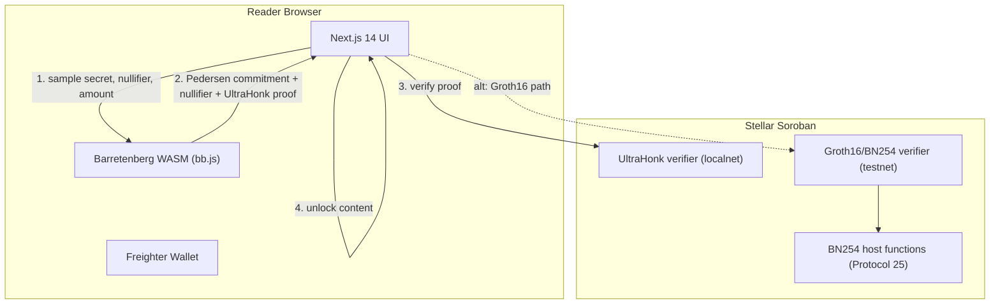

# VeilGate — Private Micropayment Paywall on Stellar

> Pay any content. Reveal nothing.

A privacy-preserving paywall on Stellar that lets readers pay for premium content
(articles, research, API endpoints, datasets) **without revealing the payment amount** to
the publisher or to on-chain observers. A zero-knowledge proof hides what you paid; the
publisher still gets a payment they can verify is real.

Built for the **Stellar Hacks: Real-World ZK** hackathon (deadline 29 Jun 2026 19:00 UTC).

---

## Problem

Publishers want to monetize content. Readers want privacy. Today you choose one:

- **Stripe / credit card** — the publisher and the bank see your card, email, identity, the
  exact amount, and your purchase history.
- **Crypto on-chain** — anyone can see exactly how much you paid, when, and to whom. Worse
  than cards for privacy.
- **Subscriptions** — leak reading habits, require identity at signup, take a large cut.

Privacy-respecting payment for content is unsolved on Stellar. ZK proofs make it possible:
the publisher gets a payment they can verify, but the amount stays hidden.

## Solution

VeilGate uses a **zero-knowledge proof, generated in the reader's browser and verified by a
Soroban smart contract**, to hide the payment amount while keeping the payment verifiable.

**What the publisher sees**
- That *someone* paid.
- A **publisher-bound nullifier** (prevents double-spend; can't be replayed to another publisher; never reveals who).
- A **Merkle root** proving the payment commitment is in the published commitment set.

**What the publisher does NOT see**
- How much you paid — only that it's within the agreed range.
- Your wallet identity — the commitment is one-time and unlinked.

**What an on-chain observer sees**
- A Soroban verification call that returns `true`. No amount, no parties.

---

## Status — what actually works

| Piece | State |
|---|---|
| **ZK circuit** (Noir) | ✅ Real, enforced constraints; 5 tests execute `main()` |
| **Browser proving** (Barretenberg) | ✅ Real UltraHonk proof generated + verified in-browser (~14.5 KB) |
| **On-chain verify — Groth16/BN254** | ✅ Deployed + verified on **testnet** with a real proof vector |
| **On-chain verify — UltraHonk (Noir-native)** | ✅ Verified on-chain on **localnet**; exceeds testnet's per-tx budget (see note) |
| **Next.js app** | ✅ Builds; reader generates a real proof, amount never leaves the device |

> **Honest finding.** UltraHonk verification runs in-wasm and is compute-heavy: on testnet it
> exceeds the per-transaction budget, so it runs on a localnet with raised limits (or a future,
> cheaper protocol version). The Groth16 verifier uses the **native** BN254 host functions
> (`pairing_check`) and verifies fine on testnet. Both paths are real; they trade off differently.

**Deployed Groth16 verifier (testnet):** `CAW4VAGEOBMQIOVFJD354BXN5O3LRP3GZGMCDEPZDNQKDUN7TZYAR45V`

---

## Architecture



---

## How it works

### 1. ZK circuit (`circuits/`, Noir)

`main` proves, in zero knowledge, that the prover:

1. **Knows the opening** of a public commitment: `commitment = Pedersen(secret, nullifier, amount)`.
2. **Derived a publisher-bound nullifier**: `nullifier_hash = Pedersen(nullifier, pub_x, pub_y)`
   — so a proof can't be replayed to a different publisher, and the spent-set is scoped per publisher.
3. **Amount is in range**: 8-bit range proof (`0..255` centi-cents).
4. **Commitment is a member** of the publisher's published set: a Merkle proof against a public
   `merkle_root`, enforced.

Every check is a real constraint. `nargo test` runs 5 tests that **execute `main()`** with concrete
witnesses (valid → satisfies; wrong secret, replayed publisher, out-of-range amount, and wrong root → rejected).

### 2. Browser proving (`app/lib/proof.ts`, Barretenberg)

The reader's browser samples `(secret, nullifier, amount)`, computes the public inputs with
`bb.pedersenHash` (bit-for-bit identical to the circuit's `std::hash::pedersen_hash`), solves the
witness, and generates a **real UltraHonk proof** (~14.5 KB). It is verified client-side before the
content unlocks. The amount never leaves the device.

### 3. On-chain verification (`contracts/`)

- **Groth16/BN254** (`contracts/verifier/`): a Soroban contract running the Groth16 pairing check via
  the **native BN254 host functions** (`g1_mul`, `g1_add`, `pairing_check`, Protocol 25). Deployed to
  testnet and proven against a real BN254 proof vector (`src/test.rs`).
- **UltraHonk** (`contracts/ULTRAHONK_ONCHAIN.md`): the Noir-native path — the browser/CLI UltraHonk
  proof is verified directly on-chain. Demonstrated on localnet (see the budget note above).

---

## Privacy & security model

- **Amount hidden:** only the range bit is public; the value stays private (8-bit MVP range).
- **No double-spend:** the publisher-bound `nullifier_hash` is revealed and recorded; a second spend
  of the same note reproduces it and is rejected.
- **No cross-publisher replay:** the nullifier folds in the publisher pubkey.
- **Unlinkable:** the commitment is one-time and not tied to a wallet identity.

> Not audited. Research/hackathon code — do not use with real funds.

---

## Repository layout

```
VeilGate/
├── circuits/                 # Noir ZK circuit (+ inline tests, Prover.toml, artifacts)
│   ├── src/main.nr
│   └── artifacts/            # vk / proof / public_inputs
├── contracts/
│   ├── verifier/             # Soroban Groth16/BN254 verifier (Rust) + real-vector test
│   └── ULTRAHONK_ONCHAIN.md  # Noir-native on-chain verification recipe + findings
├── app/                      # Next.js 14 paywall UI (real in-browser proving)
│   └── lib/proof.ts          # UltraHonk proof generation + client-side verify
├── scripts/
│   ├── prove_ultrahonk.mjs       # generate + verify a proof from the circuit
│   └── build_proof_artifacts.sh  # regenerate vk/proof/public_inputs
├── packages/verifier-bindings/   # TypeScript bindings for the verifier
└── agent/                    # Agent plugin + MCP tools (pay via chat)
```

---

## Build & run

### Circuit
```bash
cd circuits
nargo test        # 5 tests, all execute main()
nargo compile     # -> target/zk_paywall.json
```

### Groth16 verifier (testnet path)
```bash
cd contracts
cargo test            # verifies a real BN254 proof vector
stellar contract build
```

### App
```bash
cd app
npm install
npm run dev           # generates a real proof in the browser
```

### Generate a proof from the circuit
```bash
cd scripts && npm install && node prove_ultrahonk.mjs
```

---

## Toolchain

- **Noir** (`nargo` 1.0.0-beta.9) — ZK circuit DSL
- **Barretenberg** (`bb` v0.87.0 / `bb.js` 0.87.2) — UltraHonk proving
- **Soroban SDK** (Rust) — on-chain verifier; native BN254 host functions (Protocol 25)
- **Next.js 14**, **Freighter**, **Stellar SDK** — reader app + wallet

---

## License

MIT
